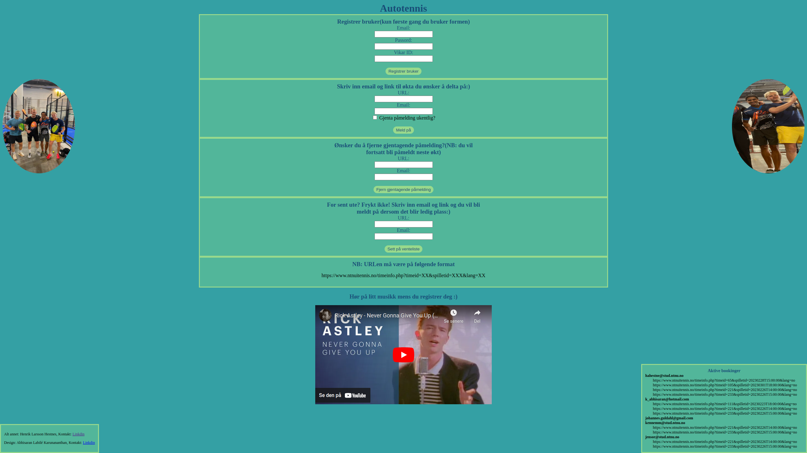

# AUTOTENNIS
Automatic tennis or padel session booking using a flask application hosted on Google Cloud Platform (GCP).

## Description
At NTNUI Tennis, you can sign up for available tennis or padel sessions 72 hours in advance. However, I found it cumbersome to remember to book the sessions 72 hours in advance, and figured out it would be interesting and instructive to automate this process. This led to the development of this service, sparing me and my friends from the hazzle of having to sit ready to book the sessions.

## Website
The website hosted on GCP is depicted below.
